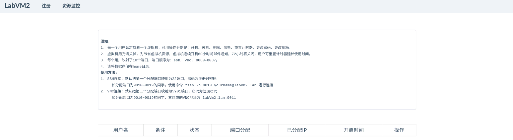
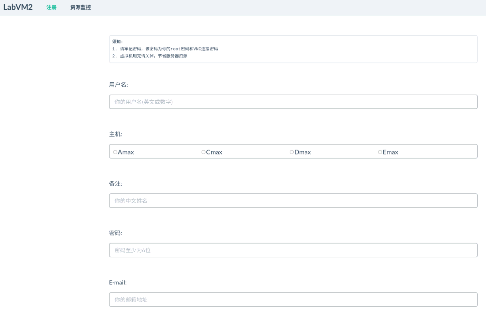
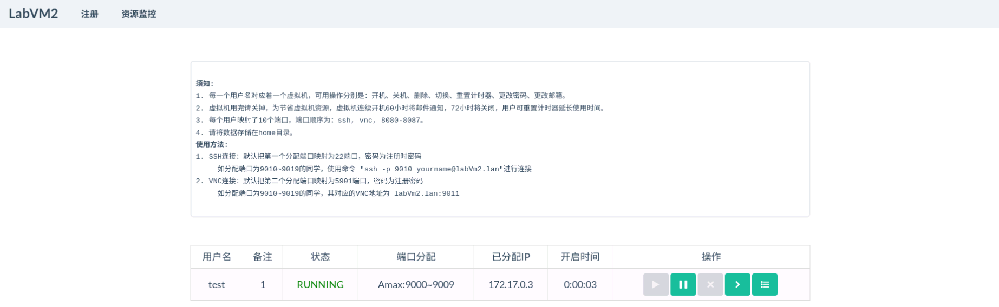
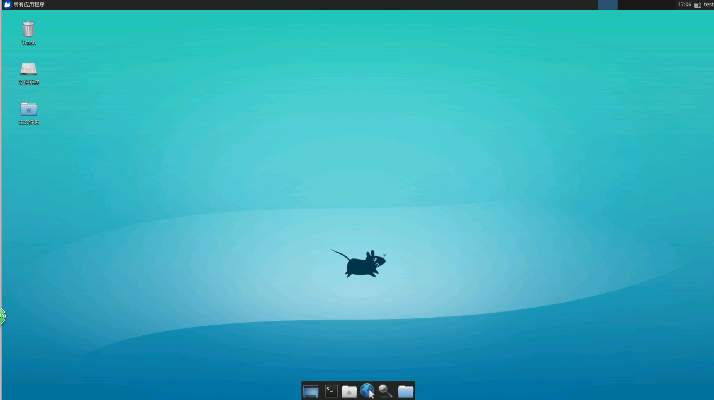
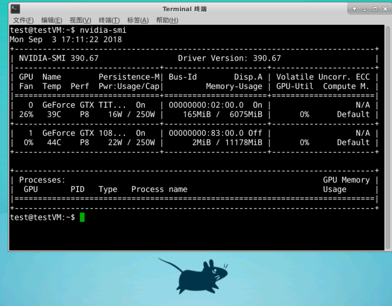
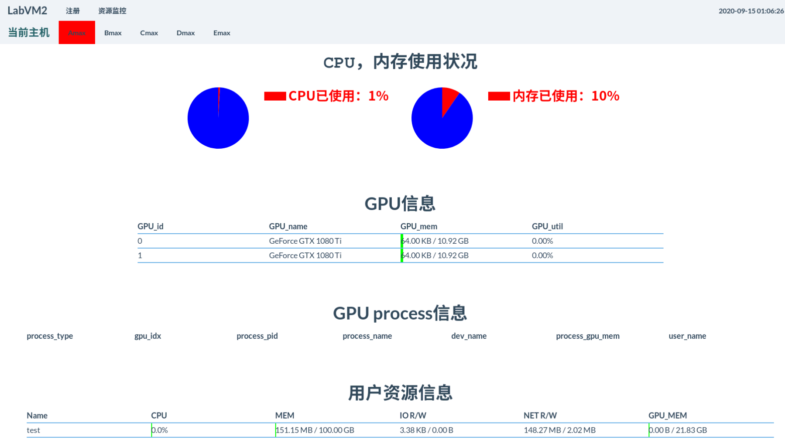
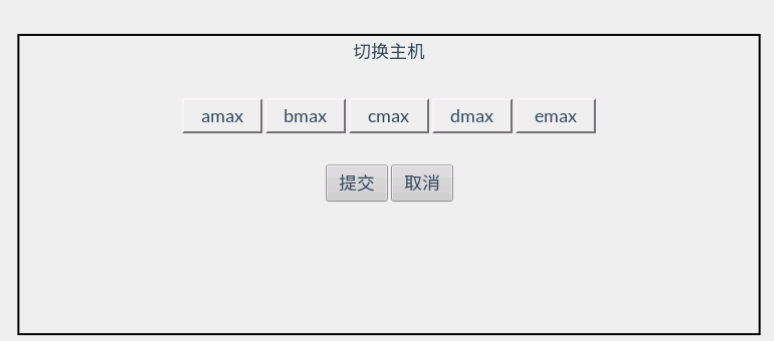
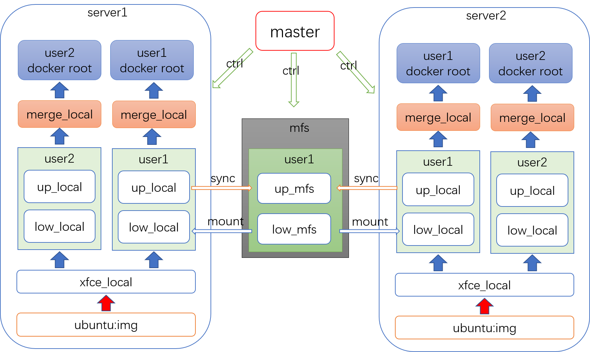
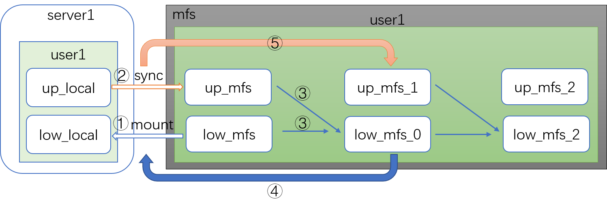
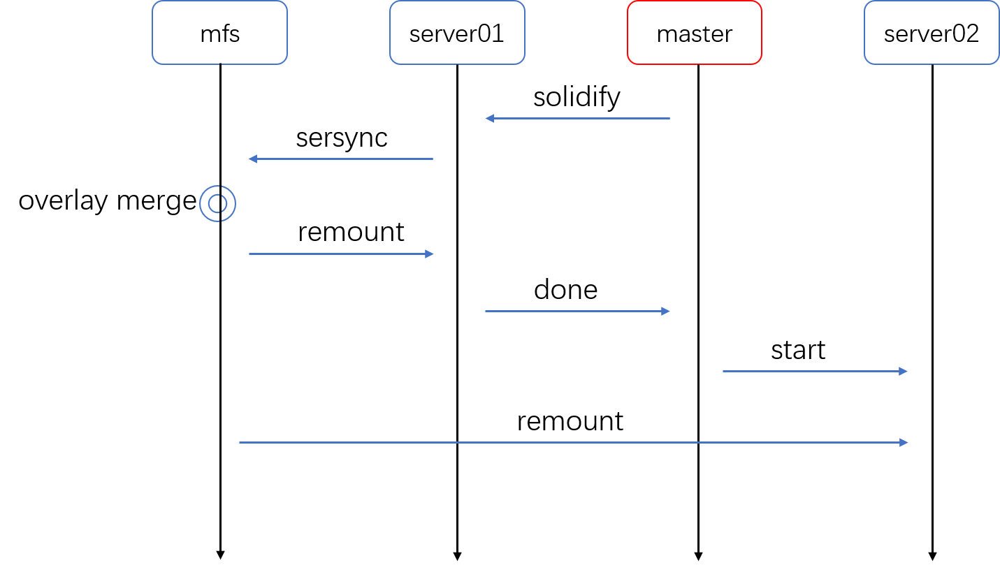

# 实验室虚拟机2.0 （labVm2, laboratory virtual machine 2.0）
深度学习服务器集群管理平台，可创建并管理多个vnc虚拟机（容器），保证主机安全与数据隔离。

# 特点
* 集群系统。基于Docker原生技术，容器可跨多主机运行，转移，存储。 
* 云存储系统。基于MFS分布式技术、Overlayfs文件系统（二次开发）和Sersync同步技术（二次开发），具有网络性能依赖低，本地高速写入，云端异步同步，数据多历史版本管理、多版本备份优点。
* 容器根文件隔离。可在主机直接访问整个容器系统（包括根目录），快速管理虚拟机文件。
* 基于Nvidia-docker2技术，容器可直接挂载主机显卡，无需额外配置驱动和CUDA，用于深度学习快速开发。
* 轻量级环境隔离，支持硬件资源（CPU、IO、内存）分配。
* Web可视化容器管理和资源监控。
* 用户容器密码加密

# 运行平台
ubuntu16.04 

# 安装条件
* docker >= 1.12 
* GNU/Linux x86_64 with kernel version > 3.10
* NVIDIA GPU with Architecture > Fermi (2.1)
* NVIDIA drivers >= 387.26(cuda9.2) 
* nvidia-docker2 
* moosefs 

# 节点安装步骤
#### 准备工作
* 安装[docker](https://docs.docker.com/install/linux/docker-ce/ubuntu/#install-from-a-package) 
* 安装[nvidia驱动](https://www.nvidia.cn/Download/index.aspx?lang=cn) 
* 安装[nvidia-docker2](https://github.com/NVIDIA/nvidia-docker)  
* 安装[mosefs](https://moosefs.com/) 

#### 拉取ubuntu镜像
docker pull ubuntu:16.04 

#### 配置sudo不用密码，labVm2结点需要无密码sudo执行
修改/etc/sudoers文件中 sudo ALL=(ALL:ALL) NOPASSWD:ALL 选项。

#### 挂载mfs文件夹
cd ~ \
mkdir mfs_dir \
\# 挂载mfs，注意！！一定要配置suid选项，否则容器不能执行sudo权限 \
sudo mount.moosefs -o suid mfs_dir -H MFS_ip_addr 

#### 解压xfce_rootfs.tgz
\# 注意必须要用sudo，保持文件夹属性不变。 \
cd ~ \
mkdir xfce_local \
sudo tar -zxvpf xfce_rootfs.tgz -C xfce_local 

#### 配置bkConfxml.xml
填入xfce_local路径\
<xfce_local str="path/to/xfce_local"/>  
填入mfs_dir路径\
<mfs_dir str="path/to/mfs_dir"/>  

#### 赋予overlay2,sersync2执行权限
chmod +x overlay2 sersync2

# 运行程序
服务主机运行： venv/bin/python webServer.py \
节点主机运行： venv/bin/python labNode.py

# 基本使用步骤
#### 打开浏览器，输入127.0.0.1:8123，即可访问web页面

#### 按照页面提示进行注册

#### 注册成功后如图所示

#### 使用vnc连接端口9001，输入vnc密码，连接成功

#### 执行nvidia_smi，若成功则表示虚拟机可使用显卡

#### 进入资源监控界面，则可观察各节点硬件资源使用情况

#### 点击切换按钮，容器可切换到对应的节点运行

# ps
* 可修改bkConfxml.xml配置文件来更改相应参数
* 虚拟机不支持硬件opengl
* nvidia驱动对docker支持不完善，服务器重启容易造成驱动崩溃，需要重装驱动，建议如无必要，不要重启服务器
* 以上测试平台信息为ubuntu16.04，python3.5，2080Ti，driver_ver=390.67，docker-ce_18.06.1，nvidia-docker2_2.0.3

# labVm2 实现原理细节

## 容器文件系统组成
对于每个用户，节点服务器先构造出一个堆叠文件夹，再配合docker镜像初始化容器，最后挂载该堆叠文件夹为根文件夹启动容器。

1、	堆叠文件夹堆叠由低到高顺序为：xfce\_local、 low\_local、up\_local。

2、	xfce\_local 存有xfce4桌面控件和相关工具包。

3、	low\_local为远程mfs文件系统挂载出来的文件夹。

4、	up\_local为本地文件夹。

5、	最后合并的merge\_local文件夹含有/bin /etc /sbin … 等系统根目录。

## 同步备份流程

1、步骤将mfs系统中的low\_mfs文件夹挂载到low\_local中。

2、将本地up\_local中文件内容同步到up\_mfs中。

3、根据overlayfs规则，将两个文件夹进行merge合并到新的low\_mfs中。

4、将新的low\_mfs绑定到low\_local。

5、sersync同步目的变更为新的up\_mfs。

## 容器切换流程

1、	master服务器向节点服务器01发送solidify请求。

2、	01收到请求后，开始向mfs同步up\_local文件夹到up\_mfs文件夹。

3、	同步完成后，mfs执行merge，将low\_mfs和up\_mfs进行合并到新版本的low\_mfs文件夹。

4、	01重新挂载新版本的low\_mfs文件夹。

5、	01告诉master服务器solidify完成。

6、	02挂载mfs最新版本的low\_mfs。

7、	02启动docker容器完成迁移。

# labVm2实现过程中遇到的技术难点
* ##远程文件读写速度慢

	一开始是设想容器读写都直接在远程文件夹上，但后来发现，如果有多个虚拟机同时进行写的话，速度有点过慢了。然后就考虑写在本地，读在远程，使用overlay文件系统来区分读写。这样能很好地兼容本地的高速读写和远程文件系统的大容量。
	
	挂载远程文件夹时考虑的是nfs文件系统，但nfs不支持xattr属性，无法作为up文件夹进行挂载。此外，尽管nfs可以作为low文件夹进行挂载，但一旦进行写操作时，overlay会触发copyup，而copyup会异常中断，导致nfs文件夹无法打开。归根到底，overlay还无法完全支持nfs。

	解决方法：放弃使用nfs，采用了mfs分布式文件系统来做overlay的底层文件夹，顶层文件夹则由本地文件系统组成。这样做的好处是当虚拟机写文件时是直接往本地写，不依赖网络，从而提高了写入速度。当虚拟机关机时，labVm2会将本地数据逐步挪到远程mfs上，节省本地硬盘空间。

* ## mfs文件系统不支持dtype属性

	mfs文件系统不支持dtype属性（可能支持？）。这导致其无法作为overlay的up文件夹进行挂载，即无法merge。但我们的备份系统需要定时合并low\_mfs和up\_mfs。

	解决方法：依照overlay的合并规则编写程序对文件夹进行合并，由于遍历up文件夹时需要使用dtype属性，所以先在本地主机取得dtype属性，然后传送给mfs，再由mfs执行merge合并。

* ## 大量小文件整体同步速度慢 

	同步一开始使用rsync做为同步技术。但在同步过程中，如果某个容器有过多的小文件（这对深度学习来说是常事），那么每次同步时rsync会检索整个文件夹从而耗时太久。

	之后选用了sersync作为同步技术，sersync使用inotify+rsync的组合来对文件进行选择性同步，可以有效地解决小文件同步问题。但sersync只能用于网络间同步，不能用于本地同步（尽管可以回环同步，但依然有其他问题），且同步后文件的权限会发生改变，由接收服务器指定。这会导致用户的一些文件由普通用户转为root用户无法执行。

	解决方法：对sersync进行二次开发，更改了权限设置、增加了本地同步、同步时间设置、无配置文件直接运行等功能。（之后会放出sersync2源码）

* ## docker不能管理容器根文件

	 docker并没有开放直接管理容器内文件的功能，只能让容器挂载主机文件夹间接实现管理。如果直接将文件夹挂载到/etc 类似的root文件夹上，那么docker是无法启动的，因为挂载后/etc变为了挂载的文件夹，是空文件夹。

	解决方法：先启动一正常容器，然后将该容器根文件打包传出主机。再将根文件解包（即xfce\_local），挂载进基本镜像，最后启动容器。

# labVm2尚待优化的点
* overlay单线程执行，合并速度需要优化。
* overlay还不能实现一些POSIX标准，例如st\_ino，st\_dev文件属性，在merge文件夹和在原文件夹并不相同。这可能会引发一些问题。

#### 贡献者
[kunxinz](https://github.com/kunxinz) 、
[dukecheung](https://github.com/dukecheung) 、
[yuna~](https://github.com/aruyuna9531) 

